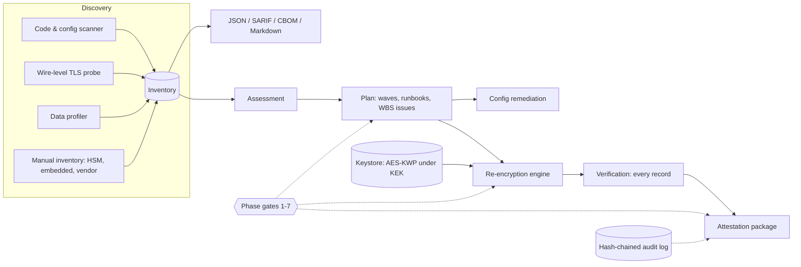

# cryptomigrate

[](https://github.com/dylanckoldan-boop/cryptomigrate/actions/workflows/ci.yml)
[](https://github.com/dylanckoldan-boop/cryptomigrate/actions/workflows/crypto-gate.yml)
[](https://github.com/dylanckoldan-boop/cryptomigrate/actions/workflows/codeql.yml)

[](LICENSE)

**An SDLC-driven toolkit that discovers, plans, executes, verifies and attests a migration from DES / Triple-DES (TDEA) to AES-256-GCM.**

It implements the *Cryptographic Algorithm Migration: DES / 3DES → AES* project workplan ([docs/workplan](docs/workplan/)) as working software: one command per SDLC activity, phase gates that check exit criteria against evidence instead of opinion, and an auditor-ready evidence package at the end. Everything algorithm-specific lives in a YAML *policy pack*, so the same machinery can drive the next migration (SHA-1 → SHA-2, RSA → post-quantum).

Version 1.1 adds **hybrid RSA + AES support** (legacy records whose 3DES keys are RSA-wrapped, and RSA protecting the new AES keys) and **security layers** for certificates, SSL/TLS handshakes, user authentication, wireless, SQL injection, buffer overflows and malware. Start with [docs/HOW_IT_WORKS.md](docs/HOW_IT_WORKS.md).

---

## Why this exists

NIST SP 800-131A Rev. 2 disallows Triple-DES for applying cryptographic protection after 31 December 2023 (decryption remains allowed only for *legacy use*), and the Rev. 3 draft moves the floor to 128-bit security. PCI DSS 4.0.1 requires at least 112 bits of effective key strength and a reviewed inventory of cipher suites (Req. 12.3.3).

Migrations rarely fail on the algorithm swap. They fail on everything around it: legacy crypto nobody knew about, hardware without AES support, data already encrypted under the old cipher, key handling, columns too narrow for the new ciphertext, no rollback path, and no evidence for the auditor. This toolkit automates each of those concerns.

## The workplan, as commands

| Phase | Workplan activity | Command | Evidence produced | Gate checks (excerpt) |
|---|---|---|---|---|
| 1 Initiation | Charter, sponsor, governance | `cryptomigrate init --github` | `migration.yaml` (charter), CI gate, issue forms, CODEOWNERS | charter fields filled, frameworks declared, sponsor sign-off |
| 2 Discovery | Cryptographic inventory, compatibility & gap assessment | `discover`, `assess` | `inventory.json`, **CycloneDX 1.6 CBOM**, **SARIF**, `assessment.md` | every finding owned, every endpoint probed, every data source profiled |
| 3 Design | Target architecture, key management plan, runbooks | `keys init`, `keys import-legacy`, `plan` | wave plan, per-system runbooks, key-management plan, WBS → GitHub Issues | active AES key, legacy keys present, no too-narrow columns, rollback defined |
| 4 Build | Code/config changes, security review | `remediate`, `selftest` | config diffs + run manifests | known-answer tests pass, no DES in code, CI gate wired |
| 5 Test | Functional, tamper, performance, UAT | `validate`, `reencrypt` (dry run) | validation report, dry-run manifests | all checks pass, full dry run with zero errors per data source |
| 6 Deploy | Phased rollout, re-encryption, rollback readiness | `reencrypt --apply` (waves, canary), `rollback` | run manifests, column-level backups | every source applied, config & endpoints clean, CAB approval |
| 7 Closeout | Final scan, key destruction, compliance evidence | `verify`, `keys destroy`, `attest` | verification report, **attestation zip with SHA-256 manifest** | 100 % of records AES-GCM, legacy keys shredded, audit chain intact |
| any | Status, governance | `gate --phase N`, `status`, `audit verify` | `gates/phase-N.json`, hash-chained audit log | — |

The full mapping (activities → commands → artifacts → gate criteria → GitHub features) is in [docs/SDLC_MAPPING.md](docs/SDLC_MAPPING.md); requirement-level traceability (FR-01…FR-06, NFR-01…NFR-05, R-01…R-07) is in [docs/TRACEABILITY_MATRIX.md](docs/TRACEABILITY_MATRIX.md).

## Quick start: watch a complete migration

```bash
git clone https://github.com/dylanckoldan-boop/cryptomigrate && cd cryptomigrate
python -m pip install -e ".[dev]"
bash examples/demo/run_demo.sh            # ~10 seconds
```

The demo builds a fake legacy system with:

- Java, Python and Go code using 3DES
- 50 encrypted SSNs and 120 encrypted card numbers
- 40 *hybrid* messages, each with an RSA-wrapped 3DES key
- 12 encrypted archive files
- an HSM in the manual inventory
- layer weaknesses: SQL injection, disabled TLS verification, `strcpy` with the stack protector switched off, TLS 1.0 in nginx, TKIP Wi-Fi, and an expired RSA-1024 certificate whose private key is encrypted with 3DES

It takes that system through all seven phases. Along the way it runs a canary with a rollback drill and a wave-by-wave rollout, crypto-shreds both legacy keys under the two-person rule, and produces the attestation. Human approvals and developer fixes are simulated. It ends with:

```
phase  name                            exit criteria  status
1      Initiation                      4/4            PASS
2      Planning & Discovery            9/9            PASS
3      Analysis & Design               7/7            PASS
4      Development / Implementation    5/5            PASS
5      Testing & Validation            7/7            PASS
6      Deployment / Phased Rollout     7/7            PASS
7      Post-Implementation & Closeout  7/7            PASS

All seven phase gates pass. Migration complete.
```

## Using it on your system

```bash
pip install "cryptomigrate @ git+https://github.com/dylanckoldan-boop/cryptomigrate@v1.1.0"
cd your-system-repo
cryptomigrate init --github                 # Phase 1: migration.yaml + CI gate + issue forms
$EDITOR migration.yaml                      # charter, systems & owners, legacy profiles, data sources
export CRYPTOMIGRATE_KEK=$(cryptomigrate keys new-kek)   # then store it in your secrets manager / HSM
cryptomigrate gate --phase 1
cryptomigrate discover && cryptomigrate assess           # Phase 2
cryptomigrate status                                     # what is left, at any time
```

Then follow the generated runbooks in `artifacts/plan/runbooks/`. The two pieces of configuration that make the automatic transition possible are:

* **`legacy_profiles`**: how each legacy system stored ciphertext (DES/3DES, CBC/ECB, IV prefix or fixed, PKCS#7/zero padding, base64/hex/raw). `cryptomigrate validate` proves the profile against real sampled data before anything is written.
* **`data_sources`**: where that ciphertext lives: any DB-API 2.0 database (PostgreSQL, MySQL, Oracle, SQL Server, SQLite…) or files on disk.

The CI gate (`.github/workflows/crypto-gate.yml`) blocks pull requests that introduce DES/3DES and publishes findings to GitHub code scanning. Production stages run through [the migration pipeline](.github/workflows/migration-pipeline.yml), where a GitHub *environment* with required reviewers acts as your change-approval board. See [docs/GITHUB_INTEGRATION.md](docs/GITHUB_INTEGRATION.md).

## How the automatic transition stays safe

| Property | How it is enforced |
|---|---|
| Nothing changes by accident | Re-encryption and remediation are **dry runs unless `--apply`**; apply can require `--change-ticket` (NFR-04) |
| Verified before trusted | Pre-flight known-answer tests (NIST/IETF vectors); legacy profiles validated against real data |
| Always reversible until close-out | Original ciphertext backed up per value **before** writing; `rollback` restores it exactly |
| Never clobbers live writes | Compare-and-swap updates (`WHERE pk = ? AND col = <value read>`); concurrent changes are skipped |
| No silent truncation | Written values are **read back inside the transaction**; a mismatch rolls the batch back |
| Restartable | Idempotent (AES-GCM values are skipped) with checkpoints and `--resume` |
| Can't regress to DES | The legacy module is **decrypt-only**; encryption can only emit AES-GCM (tested) |
| Can't lose data by shredding | `keys destroy` refuses while any record still depends on the legacy key |
| No secret leakage | No plaintext or plaintext hash is persisted; key material redacted from reports |
| Tamper-evident history | Every key event, run, rollback and gate evaluation goes to a hash-chained audit log |
| Ciphertext can't be swapped | AES-GCM binds each value to its context (`table.column#pk`) as associated data |
| Malware isn't re-sealed | Optional ClamAV scan of decrypted content before re-encryption; detections stay encrypted (fail closed) |
| No irreversible step by one person | `keys destroy` can require two distinct recorded approvers (`dual_control`) |
| Keys never reach disk by accident | Core dumps disabled at start-up; state 0700, keystore and audit log 0600 |

On a reference machine, AES-256-GCM decrypted a 256-byte record in **1.9 µs versus 17 µs for 3DES-CBC**, and 64 KiB about **290× faster**. `validate` measures this on your hardware against the NFR-01 budget.

## Hybrid RSA + AES systems

| Situation | Support |
|---|---|
| Legacy records are `RSA(3DES key) ‖ IV ‖ ciphertext` (S/MIME-style envelopes) | `key_transport: rsa-pkcs1v15 / rsa-oaep-sha1 / rsa-oaep-sha256` legacy profiles; `keys import-legacy --algorithm RSA` |
| You want RSA to protect the new AES keys | `keystore.wrap: rsa-aes-kwp` (RSA-OAEP-SHA256 + AES-KWP, PKCS#11 `CKM_RSA_AES_KEY_WRAP`); rotation needs only the public key |
| Code uses CMS/S-MIME with 3DES, DES OIDs, RSA PKCS#1 v1.5 or small RSA keys | `CM-CMS-001`, `CM-OID-*`, `TLS-RSA-002`, `TLS-RSA-001` |

## Security layers

| Layer | Prevention it enforces | Checks |
|---|---|---|
| Certificates (`pki-tls`) | automated short-lived certs, strong keys and signatures, SAN | file and endpoint certificates: weak signature/key, expiry, self-signed, SAN, CA/B lifetime limits |
| SSL/TLS handshakes (`pki-tls`) | TLS 1.2/1.3 only, verification always on, forward secrecy | protocol settings (**auto-fixed**), verification bypasses in code, live probes of versions, chain/hostname and key exchange |
| Authentication (`auth-wireless`) | IdP + phishing-resistant MFA, slow password hashes, no NTLM/PPTP | DES crypt, LM/NTLMv1, MS-CHAPv2, fast password hashes, hard-coded credentials; signed sign-offs and dual control for operators |
| Wireless (`auth-wireless`) | WPA3/SAE, PMF required, EAP-TLS with server validation | WEP, TKIP, WPA1, PMF off, WPS, PEAP-MSCHAPv2 without CA validation |
| SQL injection (`secure-coding`) | parameterized queries, least privilege | formatted/concatenated SQL in Python, Java, PHP, JS/TS, .NET, Go |
| Buffer overflows (`secure-coding`) | memory-safe languages, bounded APIs, OpenSSF hardening flags | unsafe C functions, mitigations disabled in builds, ELF NX/PIE/RELRO/canary/FORTIFY |
| Malware (engine + CI) | supply-chain controls, hardened host | ClamAV on decrypted data, `doctor`, pip-audit, CodeQL, dependency review, SBOM + signed provenance |

Details, limits and references: [docs/SECURITY_LAYERS.md](docs/SECURITY_LAYERS.md).

## Architecture



## What it detects

| Channel | Coverage |
|---|---|
| Source code | Java/Kotlin/Scala (JCA/JCE, PBE), Python (PyCryptodome, pyca/cryptography, pyDes), C#/VB/PowerShell (.NET), Go, JavaScript/TypeScript (Node, CryptoJS), C/C++ (OpenSSL EVP & low-level, CryptoAPI/CNG), PHP, Ruby, Rust, SQL (Oracle DBMS_CRYPTO, SQL Server, MySQL `DES_ENCRYPT`) |
| Configuration | OpenSSL-syntax cipher lists (nginx, Apache, HAProxy, Postfix, MySQL, openssl.cnf), IANA suite lists (Tomcat, Java, Spring, .NET), OpenSSH, IPsec (strongSwan/Libreswan), Cisco/Junos devices, Kerberos, SNMPv3, GnuPG, Windows SCHANNEL `.reg` exports (UTF-16), XML Encryption (SAML/WS-Security), PKCS#12/PEM key protection, generic app settings |
| Network | TLS endpoints, probed with a hand-built ClientHello so detection works even where the local OpenSSL has 3DES compiled out |
| Data at rest | Key-less block-size forensics on sampled values; projected AES-GCM size vs. column width |
| Manual | HSMs, embedded devices, third-party/vendor systems tracked as first-class findings |
| Certificates | X.509 files (PEM/DER) and live endpoint certificates, inventoried as CBOM `certificate` assets |
| Binaries | ELF executables and shared objects (`--binaries`) |
| Security layers | 44 more rules across PKI/TLS, authentication & Wi-Fi, SQL injection & memory safety (79 rules in total) |

Suppressions are explicit and auditable: inline `cryptomigrate: ignore=RULE -- justification`, file-level `ignore-file`, or time-boxed governance exceptions with an approver and expiry date. Suppressed findings stay visible in the inventory and attestation.

## Repository layout

```
src/cryptomigrate/
  crypto/        AES-GCM v2 envelope, decrypt-only legacy DES/3DES (incl. RSA-wrapped hybrid), CryptoService, KATs
  keys/          keystore (AES-KWP or RSA-OAEP+AES-KWP wrapping, lifecycle, audit)
  discovery/     policy packs, scanner, validators/fixers, TLS probe & handshake assessment, certificates,
                 ELF binary hardening, data profiler
  migration/     DB-API & file adapters, re-encryption engine (backup, CAS, read-back, resume, rollback)
  reporting/     JSON/SARIF/CBOM/Markdown, assessment, plan & runbooks, attestation
  policies/      des-to-aes, pki-tls, auth-wireless, secure-coding (79 rules, compliance mappings)
  templates/     migration.yaml charter template, GitHub governance templates
  validation.py  verification.py  remediation.py  gates.py  malware.py  doctor.py  cli.py
tests/           129 tests incl. real TLS servers, compiled binaries, fake clamd, CycloneDX schema validation
examples/demo/   legacy-system generator and end-to-end SDLC script
docs/            SDLC mapping, traceability matrix, specs, operations, standards, original workplan
.github/         CI, self crypto-gate, migration pipeline, issue forms, PR template, CODEOWNERS
```

## Documentation

| Document | Contents |
|---|---|
| [HOW_IT_WORKS.md](docs/HOW_IT_WORKS.md) | Installing, running, the per-record process, hybrid RSA + AES, how the repo solves the problem |
| [SECURITY_LAYERS.md](docs/SECURITY_LAYERS.md) | Certificates, TLS, authentication, wireless, SQL injection, memory safety, malware |
| [SDLC_MAPPING.md](docs/SDLC_MAPPING.md) | Phase-by-phase: workplan activities, commands, artifacts, gate criteria, GitHub features |
| [TRACEABILITY_MATRIX.md](docs/TRACEABILITY_MATRIX.md) | Every FR/NFR/risk/WBS item → implementation → test → evidence |
| [OPERATIONS.md](docs/OPERATIONS.md) | Running against production databases, dual-mode window, rollback window, troubleshooting |
| [KEY_MANAGEMENT.md](docs/KEY_MANAGEMENT.md) | KEK handling, legacy key ceremony, lifecycle, HSM/KMS integration |
| [ENVELOPE_SPEC.md](docs/ENVELOPE_SPEC.md) | Language-neutral ciphertext format with interoperability vectors |
| [GITHUB_INTEGRATION.md](docs/GITHUB_INTEGRATION.md) | CI gate, code scanning, environments as approvals, self-hosted runners |
| [EXTENDING.md](docs/EXTENDING.md) | New policy packs (e.g. SHA-1 → SHA-256), adapters, fixers |
| [STANDARDS.md](docs/STANDARDS.md) | Standards and controls implemented, with references |

## Limitations

* **Application code is guided, not rewritten.** Code findings come with language-specific remediation in the runbooks; configuration files and data at rest are migrated automatically. Python services can adopt `CryptoService` directly; other languages implement the [envelope spec](docs/ENVELOPE_SPEC.md).
* **Protocols that need a peer are never auto-changed** (IPsec, Kerberos, SNMPv3, network devices): changing one side would drop the tunnel or realm. They are planned and tracked instead.
* **SQL adapter assumptions:** a single-column, orderable primary key, and equality comparison on the encrypted column (Oracle LOB columns need a custom adapter).
* **The local keystore is a starting point.** Production KEKs belong in an HSM or cloud KMS; see [KEY_MANAGEMENT.md](docs/KEY_MANAGEMENT.md). File deletion cannot guarantee physical erasure on SSDs.
* **Detection is pattern-based on source and configuration.** Compiled third-party binaries need SCA/binary analysis; record them as manual assets meanwhile. The TLS probe covers direct TLS 1.0–1.2 (3DES does not exist in TLS 1.3), not STARTTLS.
* **Layer rules are pattern-based**, not taint analysis: pair the SQL-injection rules with CodeQL/Semgrep data-flow analysis. Wireless checks read configuration files (no RF scanning); binary checks cover ELF only; ClamAV is signature-based.
* Standards change: re-check [STANDARDS.md](docs/STANDARDS.md) against current publications before relying on it for compliance.

## Development

```bash
make dev        # editable install with test extras
make check      # ruff (incl. bandit security rules) + selftest + pytest
make demo       # end-to-end SDLC demo
make gate       # this repository's own crypto gate
```

## License

MIT - see [LICENSE](LICENSE). Copyright (c) 2026 Dylan C. Koldan.
